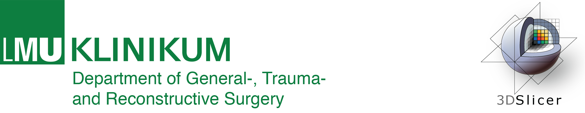
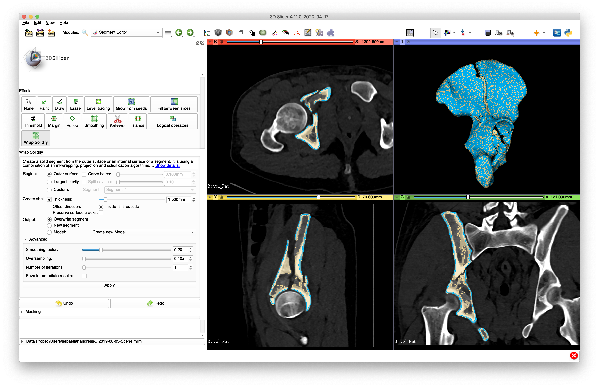
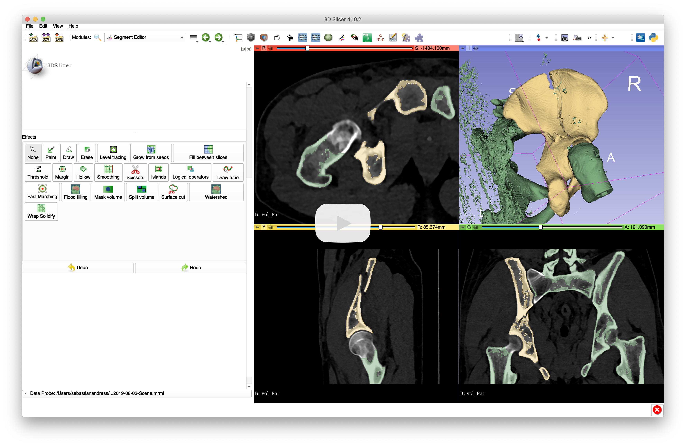
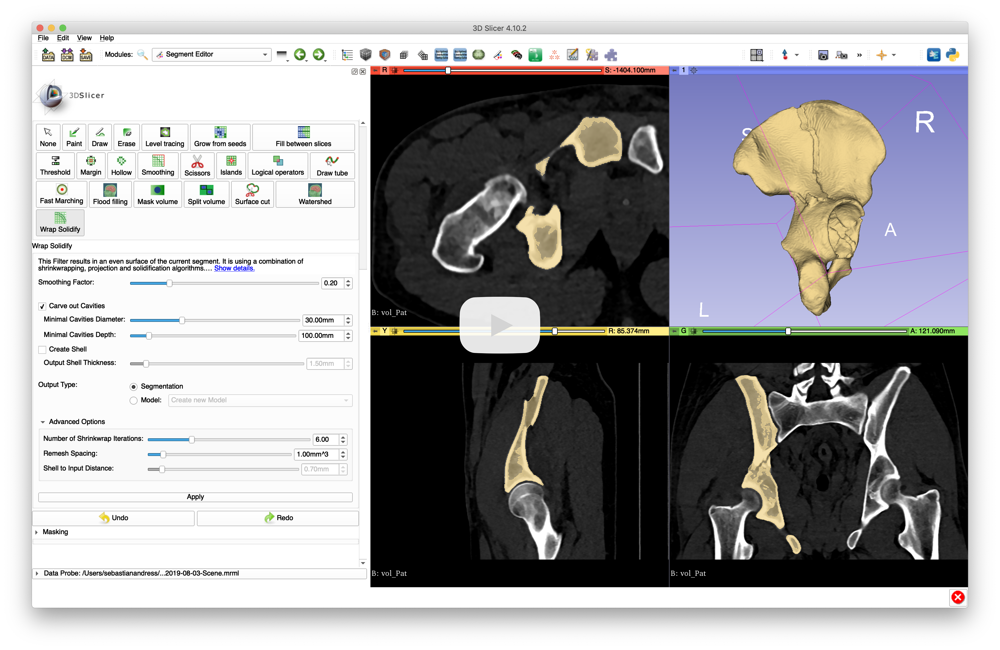

# Surface Wrap Solidify

This module for [3D Slicer](https://www.slicer.org) that can fill in internal holes in a segmented image region or retrieve the largest cavity inside a segmentation.

**Copyright &copy; 2020, Sebastian Andreß**\
All rights reserved. Please find the license [here](https://github.com/sebastianandress/Slicer-SurfaceWrapSolidify/blob/master/LICENSE.md).

Please cite the corresponding paper when using this filter for publications:

    @article{3DPrintWrapSolidify,
        author      = {Weidert, Simon and Andress, Sebastian and Linhart, Christoph and Suero, Eduardo M. and Greiner, Axel and Böcker, Wolfgang and Kammerlander, Christian and Becker, Christopher A.},
        title       = {3D printing method for next-day acetabular fracture surgery using a surface filtering pipeline: feasibility and 1-year clinical results},
        journal     = {International Journal of Computer Assisted Radiology and Surgery},
        publisher   = {Springer},
        date        = {2020-01-02},
    }

## Introduction

This segmentation tool was designed for creating fractured bone models for fast 3D printing. Especially in orthopedic trauma surgery, the editing time, as well as the printing time should be as short as possible. Using this effect helps to fulfil both features. Also, by removing inner cancellous structures, it is possible to achieve a fracture reduction on the printed model.

In our use-case, we used this effect after applying a simple threshold operation and separating the bone with simple brushing and island techniques. See the [workflow example videos](https://1drv.ms/v/s!AqzdGuIdWLfeiNpPJhrVKhDsuxqw7w?e=6DOqgo). The effect was tested on more than 30 acetabular fracture models, it reduced the printing time about 70%.

While the segmentation tool was originally designed for 3D printing fractured bone models, it has proven to be effective in a wide range of other applications that require removing or segmenting internal holes in a segment.

## How to install

- [Install 3D Slicer](https://slicer.readthedocs.io/en/latest/user_guide/getting_started.html#installing-3d-slicer) (minimum version: Slicer-4.11)
- [Install **SurfaceWrapSolidify** extension](https://slicer.readthedocs.io/en/latest/user_guide/extensions_manager.html#install-extensions)

## How to use

- Load an image. Example images are available in _Sample data_ module.
- Use _Segment Editor_ module to create an initial segmentation.
    - For example use **Threshold** effect, set the level between 300 and the maximal Hounsfield Unit. By using the sphere brush, first erase the femoral head, and subsequently connecting parts in the sacroiliac joint. Using the __Islands__ effect, the exempted hemipelvis was added to a separate segment.

- Go to **Wrap Solidify** effect and adjust options as needed.
  - For example, to create fast printable bones, preserving surface cracks: enable _Carve holes_, enable _Create shell_ (to save material in 3D printing and be able to preserve surface cracks), select _model_ for _output_ to preserve maximum details (and to be able to save the output directly as a 3D-printable STL file).
- Click **Apply**. Processing should be completed within about a minute.
  - For example, for the inputs described above, the processing time was 1:46 min on a Apple MacBook Pro 2017 (3.1 GHz Intel Core i7 CPU, 16 GB RAM).
- Use menu: _File_ / _Save Data_ (or go to _Data_ module, right-click the output model, and choose _Export to file..._) to save the output model to 3D-printable STL file

Example processing result:

## Processing parameters

- **Region**
  - **Outer surface:** Fill internal holes in a segment.
    - **Carve holes** can be enabled to preserve surface concavities. Concavities that have smaller opening than the specified diameter value are filled in the output segment. Opening refers to the diameter of the narrowest region that separates the cavity from the region outside the segment.
      - Example: Internal holes that have no connection to outside the segment (_A_) are always filled. Cavities that have a narrow connection to outside (_B_ and _C_) are filled if the opening is smaller than the specified diameter value. _B_ has smaller opening (about 5mm) then _C_ (about 30mm), therefore _B_ is filled when a smaller diameter value (10mm) is specified.

  - **Largest cavity:** return the largest internal cavity within a segment.
    - **Split cavities** can be enabled to ignore small cavities connected to the main one. Cavities that have smaller opening than the specified diameter value are removed from the output segment. Opening refers to the diameter of the narrowest region that separates the cavity from the main one.
      - Example: Largest cavity is the connected _A_+_B_+_C_ cavity. Region _B_ is connected to _A_ with a narrowing of about 10mm. Region _C_ is connected to _A_ with a narrowing of about 7mm.

  - **Custom:** Specify a custom initial shape for the surface wrapping. In masking section _Modify other segments_ must be set to _Allow overlap_ to allow the initial segment to overlap with the input segment.
    - In the segment list at the top: select the segment that the resulting segmentation will be snapped to. (green in the example below)
    - In the segment selector next to the "custom" option, select the initial shape that will be warped. (yellow in the example below)

- **Create shell**: If enabled then a thin shell is created from the segment.
    * _Preserve surface cracks_ makes surface cracks in the input segment preserved in the output.
    * _Offset direction_ determines if the original surface should be used as inner or outer surface of the created shell.
    * _Output shell thickness_ specifies the distance between the inner and outer wall of the shell.
- **Output**: Selects where to store the created new surface or segment. If the _model_ option is chosen then the surface mesh is not rasterized into a binary labelmap, therefore more details may be preserved.
- **Advanced options**
  - **Smoothing factor**: Specifies smoothing between iterations. Higher value makes the output smoother, removing small surface irregularities and sharp edges.
  * **Oversampling**: Specifies resolution during internal remeshing. Higher value results in higher accuracy but longer computation time. **Increase this value up to 2-4x if output does not follow the input segmentation accurately enough.**
  * **Number of iterations** specifies nunber of internal iterations to converge the initial surface to the final surface. Increase the number of iterations to 10-15 if artifacts appear in the output or output is not accurate enough even though a high oversampling value is used. Increasing the value increases the computation time.
  * **Save intermediate results**: Saves all intermediate results during processing. It can be useful for troubleshooting (understanding why the results are not as expected) or understanding what the algorithm does internally.

## How it works

The algorithm was modified compared to the originally published method, to make it more robust, faster, and reduce the number of parameters that users must specify. The algorithm was also extended to be able to get cavities (internal surfaces) in a segmentation.

The Wrap Solidify Effect internally performs the following operations:

1. A surface representation of the selected segment is created (segmented model).
    * _Smoothing Factor_ defines smoothing of the input surface representation
2. Initial surface is generated:
    * For outer surface extraction: A larger model is created around the input segmentation. The model is a large enclosing sphere if _carve holes_ is disabled, otherwise a margin growing result.
    * For largest cavity extraction: A larger model is created around the input segmentation, it is inverted, shrunk by the value specified in _split cavities_, and the largest segment is preserved.
3. Shrinkwrapping (iteratively shrinking and uniformly remeshing the sphere model to the segmented model) is used for surface definition.
    * _Number of iterations_ is used to define the number of iterations. The algorithm is more robust but it takes longer if many small iterations are performed.
    * _Smoothing Factor_ specifies strength of the filter that performs surface smoothing constrained to the original input surface.
    * _Oversampling_ is used to define resolution of remesh. Higher value results in higher accuracy but longer computation time.
4. If _create shell_ is enabled then a thin shell is created from the segment by extruding the surface in normal direction by _Output shell thickness_. If _preserve surface cracks_ option is enabled: all vertices of the surface model that are not touching the segmented model are deleted before extruding.
5. If output is segmentation: The resulting surface model is converted into a segmentation by rasterizing the closed surface into a binary labelmap.

## Acknowledgments

Thanks a lot to [Andras Lasso](https://github.com/lassoan) for also contributing and improving the module.

## Contact information

For further collaborations, patient studies or any help, do not hesitate to contact [Sebastian Andreß](mailto:sebastian.andress@med.uni-muenchen.de).
